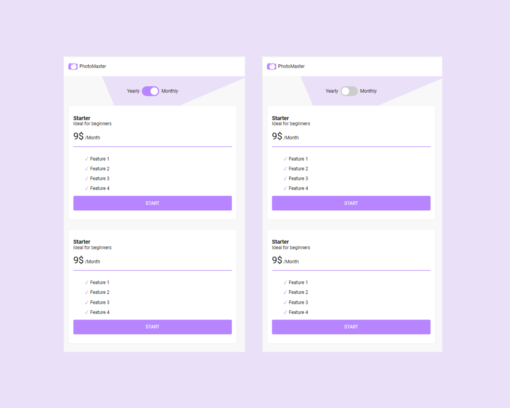

# Code Labs Academy - Photo Master

## Introduction

This is one of the coding challenges for the Fundamentals unit of the web development bootcamp offered by [Code Labs Academy](https://codelabsacademy.com/). In this unit, we learn the major concepts of HTML, CSS and JavaScript while providing challenges and homeworks for an optimal hands-on learning experience.

## Challenge description

The challenge is to build a website that looks as close as possible to this Design:

    

The website should be fully-responsive!

Note that the trickiest part is to style the toggle and make it interactive, using ONLY CSS 😉.

**Happy coding!** 😄
